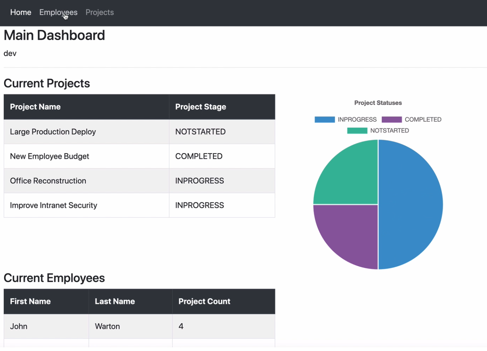

# ProjectFlow

## Description
ProjectFlow is a project management application that allows admins to assign work to other people in your team and receive insight on project management.
You can put a job or activity assign people you want collaboration to be involved.
The application uses java spring boot and postgres for the backend and java thymeleaf for the frontend of the application

## Motivation
The creation of this application came first from my desire to learn more about spring boot and later mutated itself as an app that users could use manage future projects.
Researching typical features and using my own wants I created an application that allows you to add people and projects with chart insights alongside a simple register and login page for project administration.
The goal for this application is for users and me to use the app to help with completing project better and faster than what they have been using before.
## Quick Start
This project uses jdk 8:
- In terminal in selected folder run ```Git clone https://github.com/Jruz9/ProjectMangementApp.git```
- Run command in java project folder to make jar(compiles app). ```mvn clean install```
- Click on your jar file and the application will run.
  - _Note that the app will run and no data will appear since no database is connected._
## Usage
- Create,update or remove projects
- Create, update or remove people
- Status tags
- Project status graph
- Register and login page with no O auth.
### Contribution
- Frontend
  - ThymeLeaf
  - BootStrap
- Backend
  - Java 8
  - Spring boot 2.3.4
  - Postgres
- Operating System
  - Windows
  - _Other os can work but have not been tested._
### Getting Correct java version java
-  Download Java development kit from Adoptium here ```https://adoptium.net/marketplace/?version=8&os=any```
### Setting up Local Mysql Database
- Open mysql workbench gui console.
- Create a database with root as username and password as password for local not production.
-  Run the schema sql file to create the local database.
### Build java front and back end
- IDE with java developer tools will recognize the pom xml if your in the java backend folder tree and auto build for it. If that does not happen continue forward 👇
- Open the main folder main/java/com.webapp.TaskFlow in the project and run build package option in the pom xml file for IntelliJ and similar or ```maven clean``` in the command line